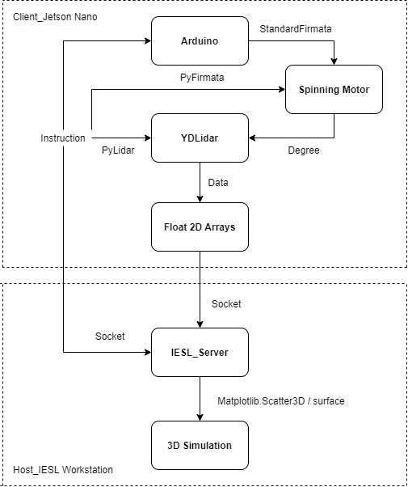

# 3D_Modeling
High-resolution space modeling grasps the attention recently. Many domains, e.g. Building construction and Disaster evaluation, applies this technique to complete tasks more efficiently. However, industrial products cost considerable money to compose a corresponding spatial graph. In this case, we attempted to devise an algorithm to plot three-dimensional space modeling with conventional two-dimensional LiDAR. In conclusion, this low-cost device spends only three minutes to finish scanning the space and produce three-dimensional plot. It has promising future to cost down products nowadays with further algorithm optimizations.

## Hardware Settlement

### Conventional LiDAR
We adopted YDLiDAR as our input source. LiDAR utilizes infrared light to measure the distance and determine the angle in planar coordinate through intensity. Therefore, it could output a two-dimensional floating array as dict in Python. We in the following processed this data to compose our desired three-dimensional plot.

### Spinning Motor
Since that LiDAR only had the capability to create arrays in a surface, we should additionally create z-axis to make the system could be performed in spherical coordinate. This spinning motor was implemented by Arduino with StandardFirmata library, which could operate two 90 degree motors simultaneously. 

### Jetson NANO
The produced arrays from LiDAR transmitted to Jetson NANO with 3G RAM. Its operation system was Ubuntu-18.04 with Python 3.7.3. All subsequent operations were conducted in Jetson NANO.

## Workflow
  
  
Above is the workflow diagram of this structure. Following is the steps about operations after connection ports assigned.
- LiDAR scans the space and sends the generated array in each degree (z-axis) to the Jetson NANO
- Jetson NANO controls the motor to rotate until reaching 180 degree
- Keep padding the arrays into a three-dimensional one and eliminate noise
- Transmit the ultimate array to workstation due to computing ability limit of Jetson NANO
- Data visualization with different angles (30-degree rotation here in default)

### Demo Video Link
https://www.youtube.com/watch?v=djTdtZT3nL4 

## Command
After configuring the ports of Arduino board and Jetson NANO, enter **Python3 scan.py**

## Contact Info
Author: Chun-Sheng Wu, MS student in Computer Engineering @ Texas A&M University  
Email: jinsonwu@tamu.edu  
LinkedIn: https://www.linkedin.com/in/chunshengwu/

*This project was in collaboration with Yuan-Han Chen in National Chiao Tung University*
